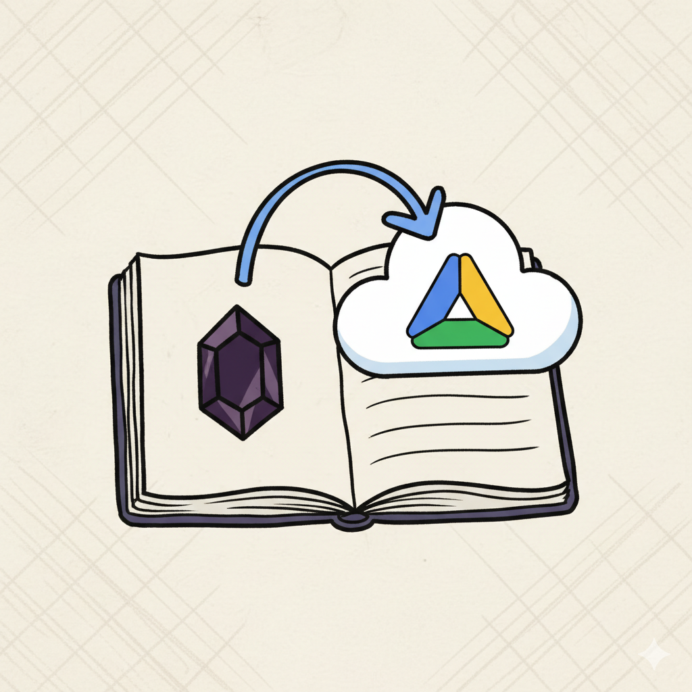

# Vync

[](https://opensource.org/licenses/MIT)

<p align="center">
  
</p>

A local-first Obsidian plugin for seamless vault synchronization with Google Drive. Direct integration, no server required, complete privacy and control.

## ✨ Features

- 🔄 **Bi-directional Sync** - Upload and download files between Obsidian and Google Drive
- 📁 **Folder Preservation** - Maintains complete directory hierarchy in Google Drive
- ⚡ **Real-time Updates** - Files sync immediately on creation or modification
- 🔐 **OAuth 2.0 Auth** - Secure Google Drive authentication directly from plugin
- 💻 **Local-First** - No external server required, runs entirely in Obsidian
- 🔍 **Smart Sync** - Intelligent change detection and conflict resolution
- 🗑️ **Tombstone Management** - Proper deletion tracking with grace periods
- 🔄 **File Rename Detection** - Handles file and folder renames efficiently

## 🚀 Quick Start

### 1. Install Plugin

#### Option A: From Obsidian Community Plugins
1. Open Obsidian Settings → Community Plugins
2. Search for "Vync"
3. Click Install
4. Enable the plugin

#### Option B: Manual Installation
```bash
# Clone and build
git clone <repository-url>
cd vync
bun install

# Build the plugin
cd packages/plugin
bun run build

# Copy to your vault's plugins folder
cp -r dist/* /path/to/your/vault/.obsidian/plugins/vync/
```

### 2. Configure Google Drive
1. Open Vync settings in Obsidian
2. Click "Authenticate with Google Drive"
3. Complete OAuth flow
4. Start syncing!

**📖 Detailed guide:** See [Quick Start Guide](docs/quick-start.md)

## 📋 Documentation

### Getting Started
- **[Quick Start Guide](docs/quick-start.md)** - Complete setup walkthrough (10 minutes)
- **[OAuth Setup](docs/quick-start.md#step-1-google-drive-api-setup-5-minutes)** - Google Drive API configuration

### Features & Reference
- **[Sync Algorithm](docs/sync.md)** - Three-way merge and conflict detection
- **[Unit Tests](packages/plugin/tests/)** - Test suite with examples
- **[Changelog](CHANGELOG.md)** - Version history and updates

### Development
- **[Plugin Source](packages/plugin/src/)** - Browse source code
- **[Contributing](#-contributing)** - How to contribute

## 🏗️ Architecture

Vync is a **local-first** plugin that runs entirely within Obsidian:

```
vync/packages/plugin/
├── src/
│   ├── main.ts                  # Plugin entry point
│   ├── services/
│   │   ├── googleDriveAuth.ts   # OAuth authentication
│   │   ├── googleDriveService.ts# Google Drive API client
│   │   ├── syncService.ts       # Sync orchestration
│   │   ├── syncState.ts         # State management
│   │   ├── tombstoneManager.ts  # Deletion tracking
│   │   ├── vaultWatcher.ts      # File change detection
│   │   └── conflictUI.ts        # Conflict resolution UI
│   └── types.ts                 # TypeScript definitions
├── tests/                       # Unit tests
└── manifest.json                # Plugin manifest
```

### How It Works

1. **Direct Integration** - Plugin communicates directly with Google Drive API
2. **Local State** - Sync state stored in `.obsidian/plugins/vync/`
3. **OAuth Tokens** - Encrypted and stored locally
4. **No Server** - Zero external dependencies, completely private

## 🔧 Configuration

### Google Drive API Setup

1. **Create Google Cloud Project**
   - Go to [Google Cloud Console](https://console.cloud.google.com/)
   - Create a new project
   - Enable Google Drive API

2. **Configure OAuth Credentials**
   - Create OAuth 2.0 Client ID (Desktop app type)
   - Download credentials JSON
   - Add to plugin settings

### Plugin Settings (in Obsidian)

```
Settings → Vync:
├── Google OAuth
│   ├── Client ID: [from Google Cloud]
│   ├── Client Secret: [from Google Cloud]
│   └── Status: ✓ Connected
├── Sync Settings
│   ├── Auto Sync: ON
│   ├── Sync Interval: 5 minutes
│   └── Conflict Resolution: Prompt
└── Advanced
    ├── Tombstone Grace Period: 30 days
    └── Debug Logging: OFF
```

## 📦 Distribution

### Publishing to Community Plugins

When ready to publish:

1. **Create Release Branch**
   ```bash
   git checkout -b release/v1.0.0
   git push origin release/v1.0.0
   ```

2. **Automatic Release** - GitHub Actions will:
   - Run tests
   - Build plugin
   - Create version tag
   - Create GitHub release
   - Attach `main.js`, `manifest.json`, `styles.css`

3. **Submit to Obsidian**
   - Fork [obsidian-releases](https://github.com/obsidianmd/obsidian-releases)
   - Add your plugin to `community-plugins.json`
   - Submit PR

## 📊 How It Works

### Sync Flow
1. **File Changed** in Obsidian
2. **VaultWatcher Detects** change event
3. **SyncService** determines action (upload/download/conflict)
4. **Direct Upload/Download** to/from Google Drive
5. **State Updated** locally with revision IDs
6. **Folder Structure** mirrored automatically

### Smart Sync Features

**Three-Way Comparison**
- Compares: Local file ↔ Last sync state ↔ Remote file
- Uses revision IDs (not timestamps) for accuracy
- Detects: unchanged, local-only, remote-only, conflicts

**Tombstone Management**
- Tracks deletions with grace periods (default 30 days)
- Syncs deletions across devices
- Prevents accidental data loss

**Conflict Resolution**
- Detects simultaneous changes on multiple devices
- Presents user with resolution options
- Preserves both versions if requested

## 🔐 Security & Privacy

### Local-First Design
- ✅ **No External Server** - Direct vault-to-Google Drive sync
- ✅ **Local OAuth Tokens** - Encrypted and stored in your vault
- ✅ **No Data Collection** - Zero telemetry or analytics
- ✅ **Open Source** - Fully auditable code
- ✅ **Standard APIs** - Uses official Google Drive API only

### Data Storage
```
.obsidian/plugins/vync/
├── data.json           # Plugin settings (no secrets)
├── sync-state.json     # Sync index (file hashes, IDs)
├── tombstones.json     # Deletion tracking
└── .oauth-tokens.json  # Encrypted OAuth tokens (local only)
```

**Note:** OAuth tokens never leave your device and are encrypted at rest.

## 🧪 Testing

### Development
```bash
cd packages/plugin

# Run unit tests
bun test

# Run linter
bun run lint

# Build plugin
bun run build

# Watch mode
bun run dev
```

### Plugin Commands (in Obsidian)
```
Cmd/Ctrl + P → Search for:
├── "Vync: Full Sync" - Sync entire vault
├── "Vync: Sync Status" - View sync state
├── "Vync: Resolve Conflicts" - Handle conflicts
└── "Vync: Clear Cache" - Reset sync state
```

### Manual Testing
1. **File Sync** - Create/edit files, verify in Drive
2. **Folder Sync** - Create nested folders, check structure
3. **Renames** - Rename files/folders, verify tracking
4. **Deletions** - Delete files, check tombstones
5. **Conflicts** - Edit same file on two devices simultaneously

## 🐛 Troubleshooting

### Common Issues

**OAuth Authentication Failed**
- Verify Client ID and Secret are correct
- Check OAuth consent screen is configured
- Ensure "Desktop app" type is selected
- Try removing and re-adding credentials

**Files Not Syncing**
- Check sync status in plugin settings
- Verify Google Drive has sufficient space
- Look for conflicts in conflict resolution UI
- Check Obsidian Developer Console (Cmd/Ctrl + Shift + I) for errors

**Sync Conflicts**
- Use "Vync: Resolve Conflicts" command
- Choose which version to keep
- Or keep both versions with different names

**Plugin Not Loading**
- Check `.obsidian/plugins/vync/` exists
- Verify `manifest.json`, `main.js`, `styles.css` are present
- Enable plugin in Settings → Community Plugins
- Check Obsidian console for error messages

**📖 More help:** [Open an issue](https://github.com/your-repo/issues)

## 📈 Roadmap

### v1.1 (Next Release)
- [ ] Delta sync for large files
- [ ] Selective sync (exclude patterns)
- [ ] Bandwidth optimization
- [ ] Sync statistics dashboard

### v1.2 (Future)
- [ ] Mobile app support (iOS/Android)
- [ ] Alternative backends (Dropbox, OneDrive)
- [ ] End-to-end encryption option
- [ ] Shared vault collaboration

### v2.0 (Long Term)
- [ ] Multi-device conflict resolution UI
- [ ] Advanced sync rules engine
- [ ] Plugin marketplace integration
- [ ] Automated backups and versioning

## 🤝 Contributing

Contributions welcome! Please:
1. Fork the repository
2. Create feature branch
3. Make changes
4. Add tests
5. Update documentation
6. Submit PR

## 📝 License

MIT License - see [LICENSE](LICENSE) file

## 🙏 Acknowledgments

Built with:
- [Bun](https://bun.sh/) - Fast JavaScript runtime
- [Elysia](https://elysiajs.com/) - Web framework
- [Google Drive API](https://developers.google.com/drive) - Storage
- [Obsidian API](https://docs.obsidian.md/) - Plugin platform

## 💬 Support

- **Documentation**: See [Documentation](#-documentation) section
- **Bug Reports**: [GitHub Issues](https://github.com/your-repo/issues)
- **Feature Requests**: [GitHub Discussions](https://github.com/your-repo/discussions)
- **Questions**: [GitHub Discussions Q&A](https://github.com/your-repo/discussions/categories/q-a)

## ⭐ Star History

If this project helps you, consider giving it a star!

---

**Status**: Beta Testing 🚧

[Quick Start](docs/quick-start.md) | [Documentation](#-documentation) | [Architecture](#-architecture) | [Contributing](#-contributing)